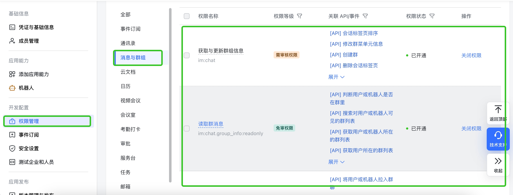
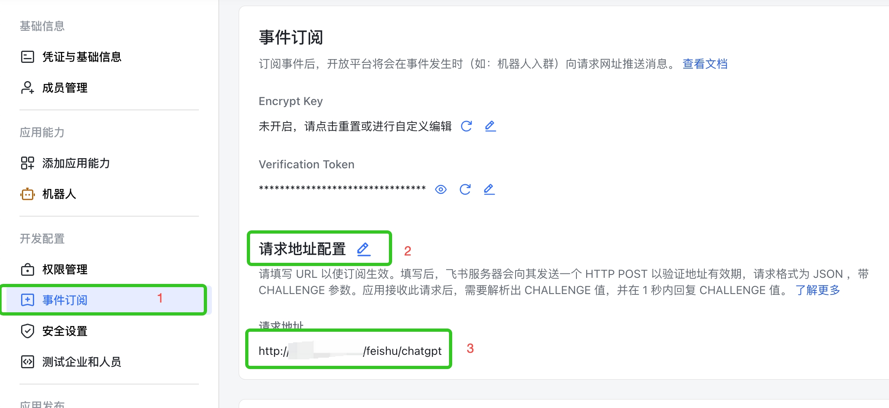

### 1. 创建一个飞书开放平台应用，并获取到 APPID 和 Secret APPID 和 Secret提供给管理员

访问 [开发者后台](https://open.feishu.cn/app?lang=zh-CN)，创建一个名为 **ChatGPT** 的应用，并上传应用头像。创建完成后，访问【凭证与基础信息】页面，复制 APPID 和 Secret 备用。

### 2. 开启机器人能力

打开应用的机器人应用功能

### 3. 开启权限并配置事件

访问开放平台页面，开通如下 7 个权限：

- 获取群组中所有消息
- 获取用户发给机器人的单聊消息
- 获取与更新群组信息
- 更新应用所创建群的群信息
- 获取用户在群组中@机器人的消息
- 获取群组信息
- 获取与发送单聊、群组消息

然后回到事件订阅界面，添加事件。调用地址需要找管理员获取

### 4. 发布版本，等待审核

上述这些都配置完成后，你的机器人就配置好了，接下来只需要在飞书开放平台后台找到应用发布，创建一个全新的版本并发布版本即可。需要公司管理员审核

### 5. 群聊添加机器人

在飞书群设置中找到”群机器人“，点击后在点击”添加机器人“，找到 **ChatGPT** 添加即可。
